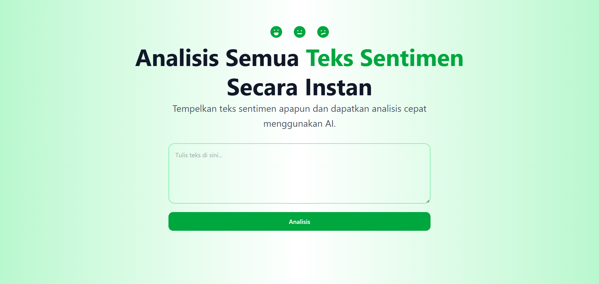

# 📊 Sentiment Analysis Frontend

Frontend web application for **AI-powered sentiment analysis**.  
Built with **React, Vite, TailwindCSS, and Framer Motion**, this app allows users to paste any text and instantly get a sentiment classification: **positif, netral, atau negatif**.

---

## ✨ Features

- ⚡ Instant sentiment analysis powered by AI backend
- 🎨 Modern UI with TailwindCSS
- 🌀 Smooth animations using Framer Motion
- 📱 Fully responsive design
- 🚀 Deploy-ready on Vercel

---

## 🛠️ Tech Stack

- **React + Vite**
- **TailwindCSS**
- **Framer Motion**
- **TypeScript**
- **Vercel (Deployment)**

---

## 📦 Installation & Setup

1. **Clone the repository**

   ```bash
   git clone https://github.com/your-username/sentiment-fe.git
   cd sentiment-fe
   ```

2. **Install dependencies**

   ```bash
   npm install
   # or
   yarn install
   ```

3. **Setup environment variables**  
   Create a file `.env.local` in the project root:

   ```env
   VITE_API_URL=YOUR_API_URL
   ```

4. **Run development server**

   ```bash
   npm run dev
   ```

5. Open in browser:  
   👉 [http://localhost:5173](http://localhost:5173)

---

## 🚀 Deployment on Vercel

1. Push your repo to GitHub.
2. Import the repo into Vercel Dashboard.
3. Add Environment Variable in Vercel project settings:
   ```
   VITE_API_URL=YOUR_API_URL
   ```
4. Deploy → your app will be live!

---

## 🚀 Result



## https://atzmos.vercel.app/

## 🤝 Contributing

Contributions are welcome! Feel free to open issues or submit pull requests.

---
